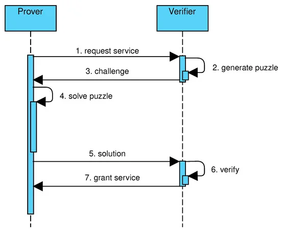

# "Word of wisdom" tcp server 

## Requirements:

Test task for Server engineer (Go)

Design and implement “Word of Wisdom” tcp server.

* TCP server should be protected from DDOS attacks with the Proof of Work (https://en.wikipedia.org/wiki/Proof_of_work), the challenge-response protocol should be used.
* The choice of the POW algorithm should be explained.
* After Proof Of Work verification, server should send one of the quotes from “word of wisdom” book or any other collection of the quotes.
* Docker file should be provided both for the server and for the client that solves the POW challenge

## How to start:
`make build` - build docker containers

`make start` - run client

### Hashcash algorithm has been chosen because of the following reasons:
- simple and easy to implement
- widely used and well-known
- resistant to DoS attacks etc.

### Algorithm description:
